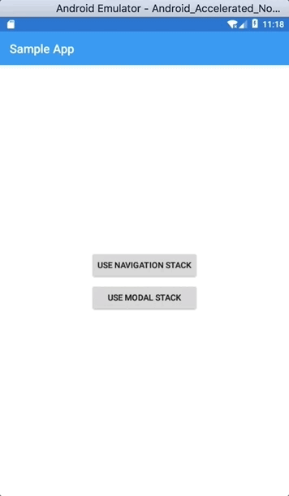
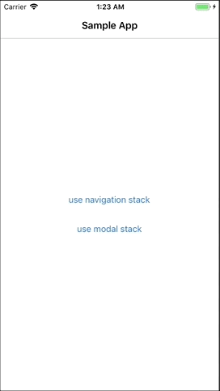

# XamarinForms.CancelableModal

Xamarin.Forms doesn't support closing modal page out of the box. We have to implement this feature manually. 

This sample project is showing how to implement a close button on modal page in Xamarin.Forms. Close button is implemented according to guidelines provided by Apple and Google.

## Android

Google docs about dialogs:
https://material.io/design/components/dialogs.html

## iOS

Apple docs about modality:
https://developer.apple.com/design/human-interface-guidelines/ios/app-architecture/modality/
